# ego Graphica - アーキテクチャ図

> 現在の実装方針をMermaidダイアグラムで可視化

---

## 1. システム全体構成

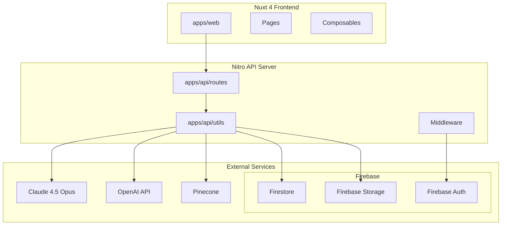

---

## 2. データフロー図

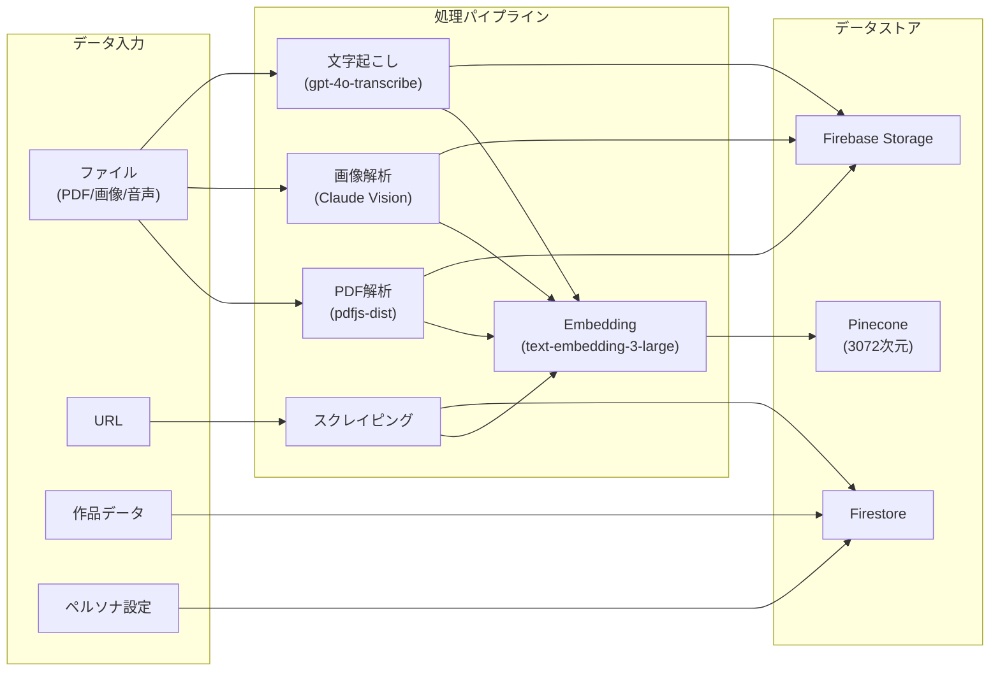

---

## 3. エージェント会話フロー

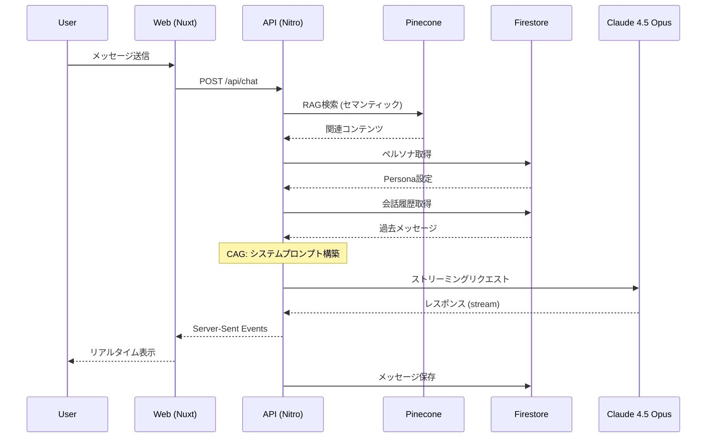

---

## 4. 認証フロー

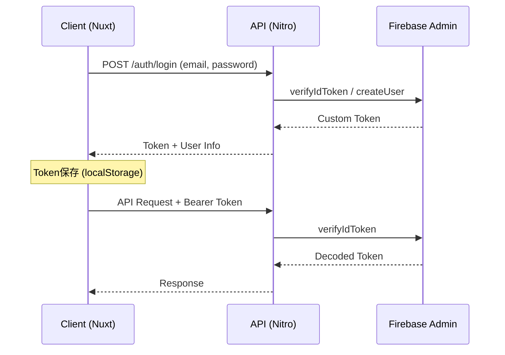

---

## 5. Firestoreコレクション構造

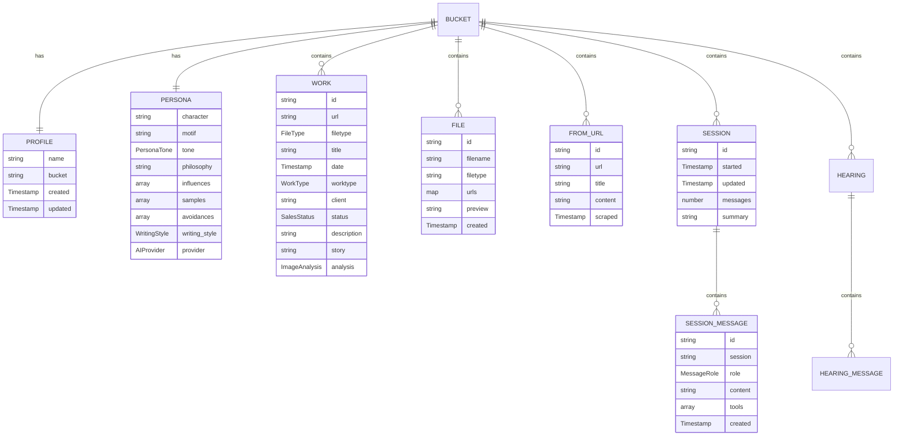

---

## 6. Pineconeベクトル構造

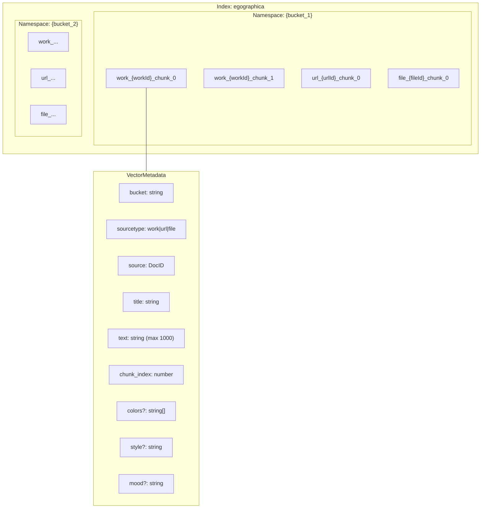

---

## 7. ファイル処理パイプライン

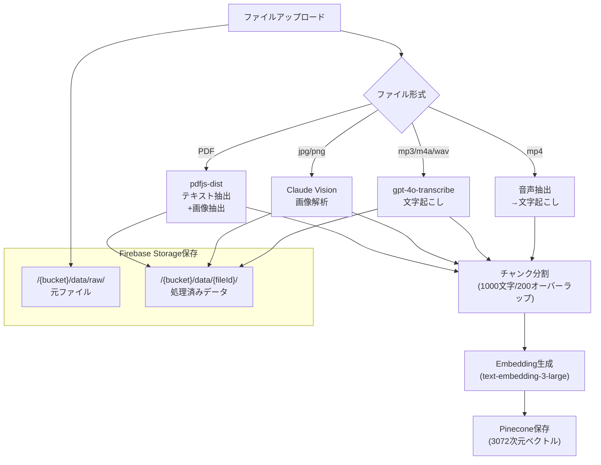

---

## 8. Tool Calling構成

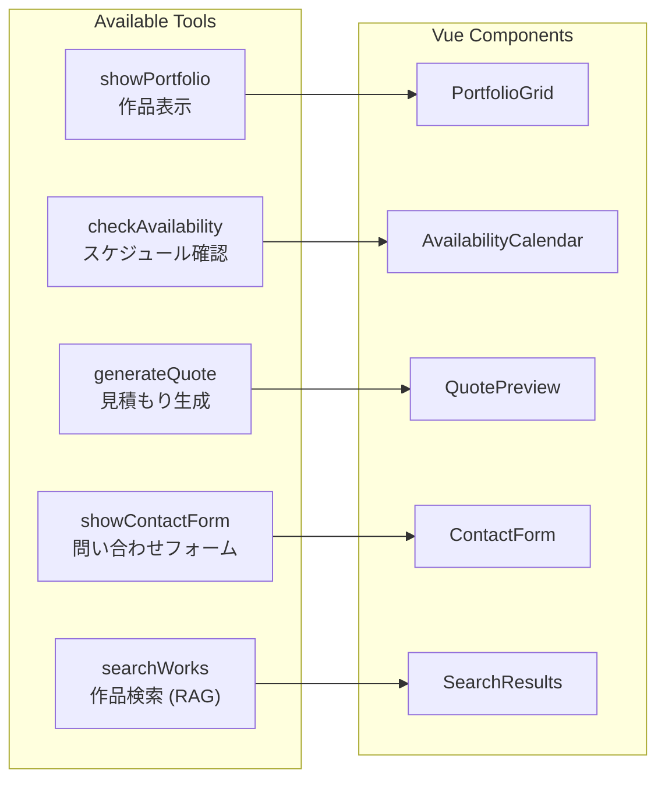

---

## 9. CAG (Context Augmented Generation) フロー

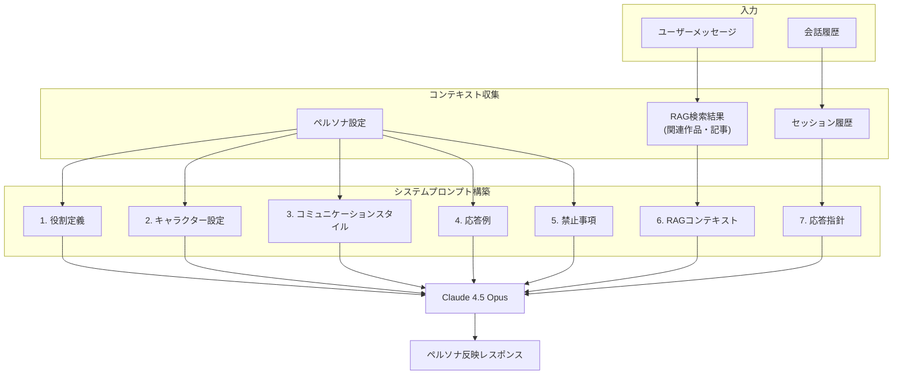

---

## 10. ディレクトリ構成

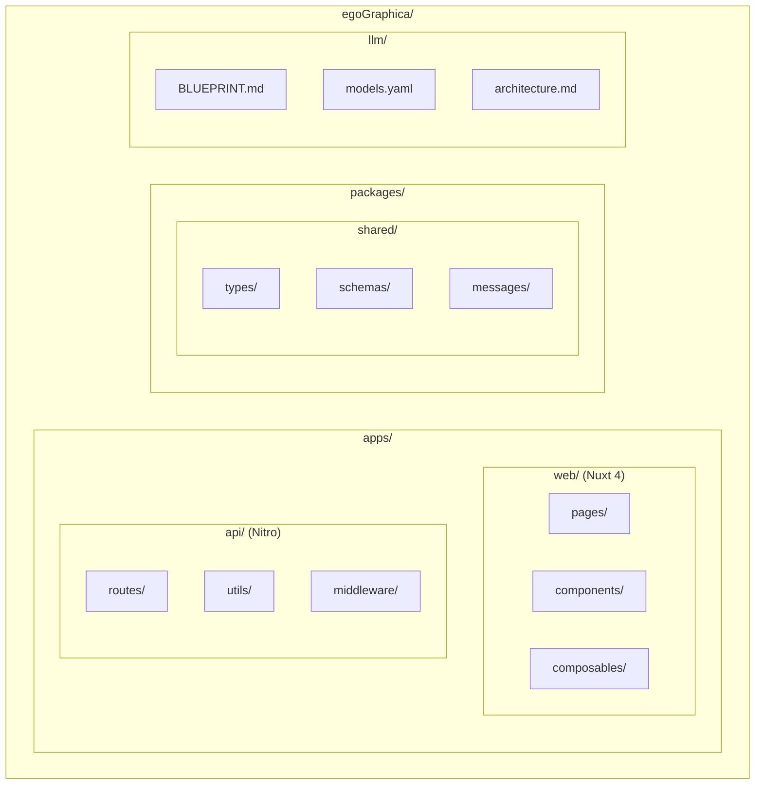

---

## 11. 画面遷移図

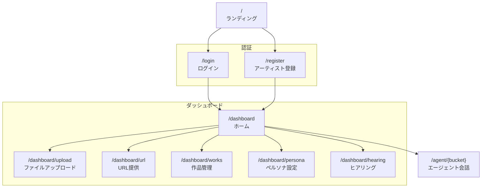

---

## 12. 最適化アーキテクチャ (実装中)

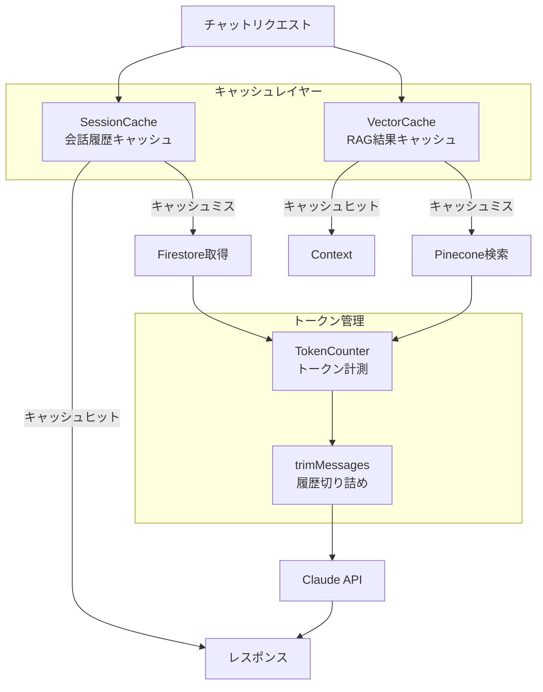
